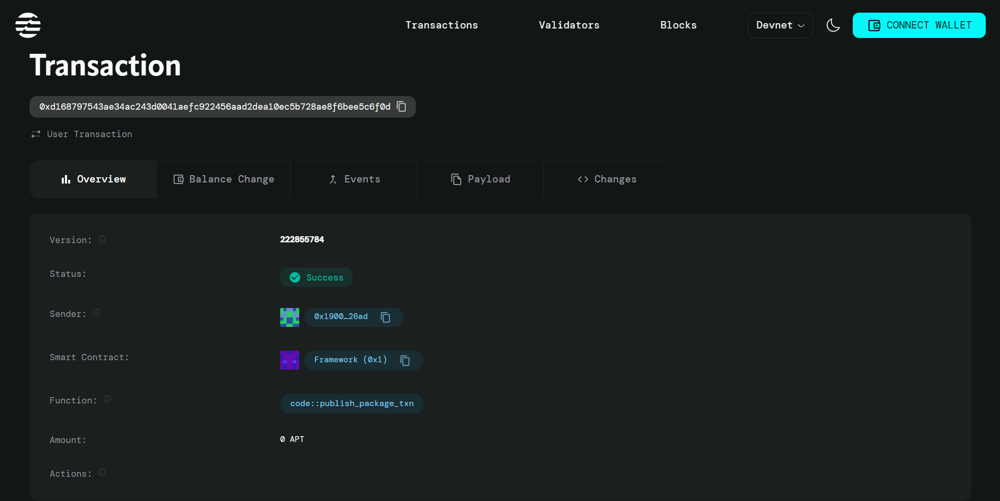

# Micro-Certification NFT Platform

## Project Title
**Micro-Certification NFT Platform** - Certify Small Course Modules

## Project Description
The Micro-Certification NFT Platform is a blockchain-based solution built on the Aptos network that enables educational institutions, online course providers, and independent instructors to issue verifiable digital certifications for small course modules and micro-learning sessions. Each certification is stored as a unique digital asset on the blockchain, ensuring authenticity, immutability, and easy verification.

This smart contract provides a decentralized approach to micro-credentialing, allowing learners to accumulate verified skills and knowledge from various sources while maintaining complete ownership and portability of their certifications.

## Project Vision
Our vision is to revolutionize the way educational achievements are recognized and verified in the digital age. We aim to create a trusted, decentralized ecosystem where:

- **Learners** can collect and showcase verified micro-credentials from multiple sources
- **Educators** can easily issue tamper-proof certifications for their courses
- **Employers** can quickly verify the authenticity of candidates' skills and knowledge
- **Educational Value** is preserved through blockchain immutability and transparency

## Key Features

### 🎓 **Digital Certification Issuance**
- Issue blockchain-based certificates for completed course modules
- Each certification contains course name, student address, issuer details, and timestamp
- Unique certification ID system for easy tracking and verification

### 🔐 **Immutable Record Keeping**
- All certifications are permanently stored on the Aptos blockchain
- Tamper-proof certification records ensure authenticity
- Transparent verification process for all stakeholders

### 👨‍🏫 **Issuer Management System**
- Initialize accounts as certified course providers
- Track total certifications issued by each provider
- Maintain comprehensive records of all issued certifications

### ⚡ **Lightweight and Efficient**
- Optimized smart contract design for minimal gas fees
- Simple two-function architecture for easy integration
- Fast certification issuance and verification process

### 🌐 **Decentralized Ownership**
- Students have complete ownership of their certifications
- Portable credentials that can be used across platforms
- No central authority required for verification

## Future Scope

### 📊 **Advanced Analytics Dashboard**
- Implement comprehensive tracking of certification trends
- Skill gap analysis and market demand insights
- Performance metrics for course providers

### 🏆 **Gamification & Rewards System**
- Achievement badges for milestone completions
- Reputation scoring for both students and issuers
- Token-based reward mechanisms for active participation

### 🔗 **Cross-Platform Integration**
- APIs for integration with popular LMS platforms
- Partnership integrations with major educational institutions
- Compatibility with other blockchain certification standards

### 🎯 **Enhanced Verification Features**
- QR code generation for instant verification
- Batch certification issuance capabilities
- Advanced search and filtering mechanisms

### 🌍 **Ecosystem Expansion**
- Multi-language support for global adoption
- Industry-specific certification templates
- Integration with professional networking platforms

### 🤖 **AI-Powered Features**
- Automated skill assessment integration
- Personalized learning path recommendations
- Fraud detection and prevention mechanisms

---

*This project leverages the power of blockchain technology to create a more transparent, efficient, and accessible approach to micro-credentialing in education.*

## Contract Details
0xd168797543ae34ac243d0041aefc922456aad2dea10ec5b728ae8f6bee5c6f0d

